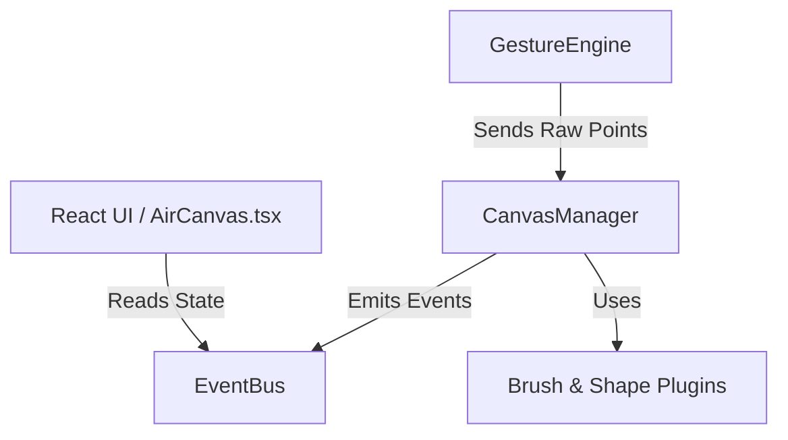

# FingerFlow Studio Architecture

FingerFlow Studio relies on a strictly decoupled architecture, separating the React UI layer from the heavy Canvas & Gesture engine processing. This ensures 60 FPS drawing performance even while React handles complex UI states.

## System Architecture

## Core Engine Components

### 1. CanvasManager
The central orchestrator of the Fabric.js canvas. It operates purely in **World Coordinates** and delegates specialized tasks to its sub-managers. It handles the raw path generation and stroke smoothing.

### 2. ViewportManager
Handles the affine transformations (`viewportTransform`) for the infinite canvas.
- Converts Screen Coordinates (mouse/hand) to World Coordinates (canvas objects).
- Manages Zoom, Pan, and boundary culling.

### 3. LayerManager
A Tag-Based layer system. Rather than using Fabric.js Groups (which disrupt object picking), every object is tagged with a `layerId`. The LayerManager handles `z-index` sorting on the canvas by evaluating active, hidden, and locked tags.

### 4. BrushManager
Uses a dynamic Plugin Architecture.
- Brushes are instantiated as classes implementing the `BrushPlugin` interface.
- Calculates physics (Velocity, Flow, Opacity, Spacing) dynamically during the `updateStroke` cycle.

### 5. ShapeManager
Uses an identical plugin architecture to the BrushManager. Includes a heuristic `ShapeRecognizer` that intercepts raw point arrays at `endStroke` and converts messy freehand into perfect vector primitives (Circle, Rectangle, Line, Arrow) with 0ms latency.

### 6. SelectionManager
Handles contextual transformation of objects.
- Single/Multi/Box Selection.
- Scaling, Rotation, Deletion.
- Obeys Layer bounds (ignores locked/hidden layers).

### 7. HistoryManager & Command Pattern
Every mutating action (Draw, Transform, Delete) is encapsulated into a `Command` class.
- The `HistoryManager` executes commands and pushes them to the Undo stack.
- This allows the `ReplayEngine` to sequentially rebuild a canvas from a stack of commands.

## Communication: EventBus
Direct dependencies between React and the CanvasManager are forbidden. Instead, the engine emits events (e.g., `history:changed`, `layer:updated`, `selection:cleared`) to an internal `EventBus`. React components subscribe to these events via `useEffect` to trigger targeted UI updates.

## Gesture Pipeline
1. `MediaPipe` tracks 21 hand landmarks at 30-60 FPS.
2. `GestureEngine` translates landmarks into semantic states (Draw, Erase, Pan).
3. If drawing, coordinates are passed through a `StrokeSmoother` (Moving Average + Chaikin's Algorithm).
4. `CanvasManager` translates smoothed Screen coordinates to World coordinates.
5. The active `BrushPlugin` renders the path.
6. On gesture end, a `Command` is generated and injected into `HistoryManager`.

## Future Extension Points
The architecture is designed to cleanly support:
- **WebSockets/WebRTC**: Commands can be serialized and broadcasted for real-time multiplayer.
- **Advanced Culling**: `ViewportManager` can hide off-screen objects for massive canvases.
- **More Plugins**: Drop new classes into `src/engine/brushes/` or `src/engine/shapes/` without modifying core logic.
